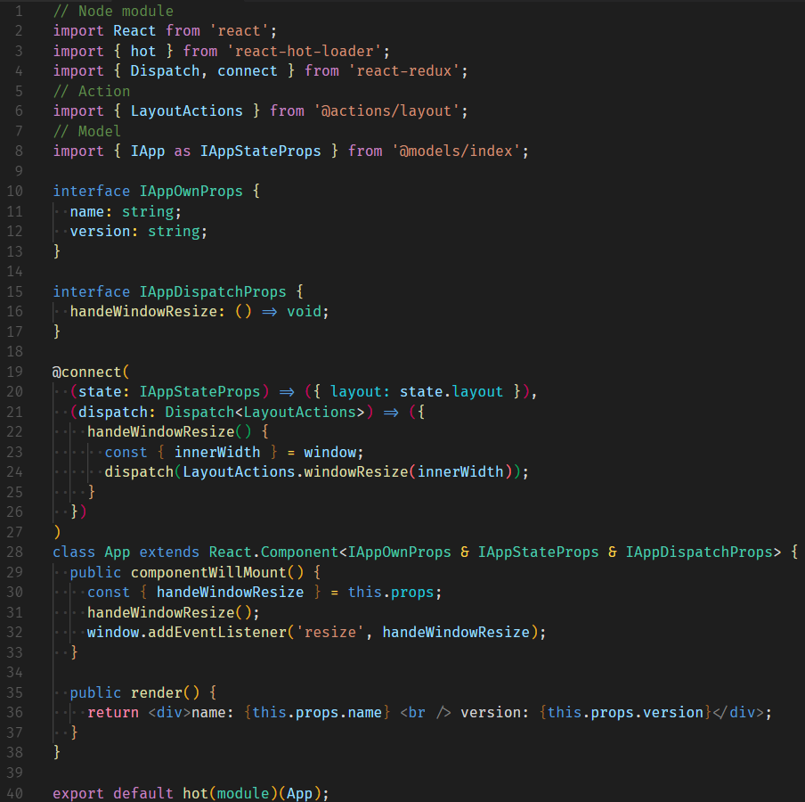

# Dark++ Regular Theme
Enhanced VScode Dark+ theme.



### Fira Code
1. Add following options in User Settings:
    ```
    {
      ...
      "editor.fontFamily": "Fira Code",
      "editor.fontLigatures": true,
      ...
    }
    ```
2. Reload VSCode window or reopen VSCode.

### Thanks to
- @idbartosz for [vscode-darkpp-italic](https://github.com/idbartosz/vscode-darkpp-italic)
